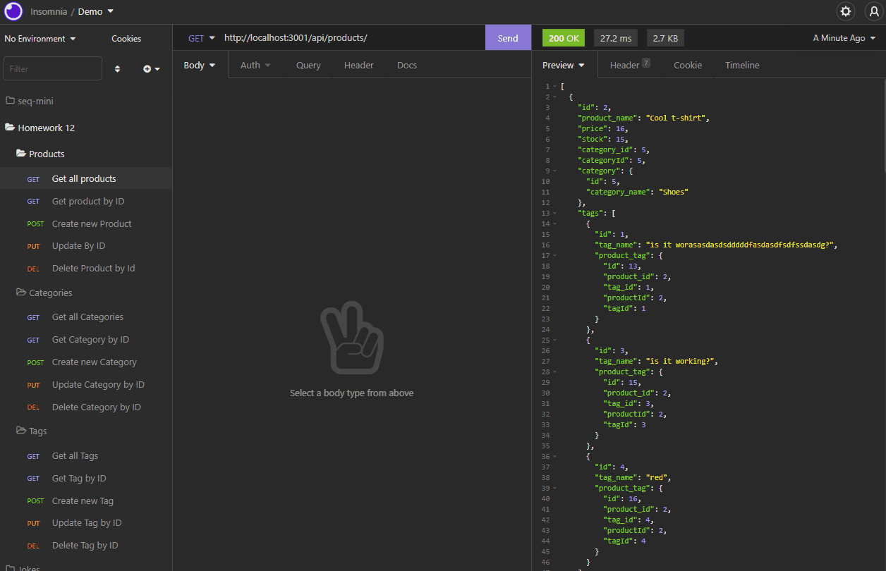
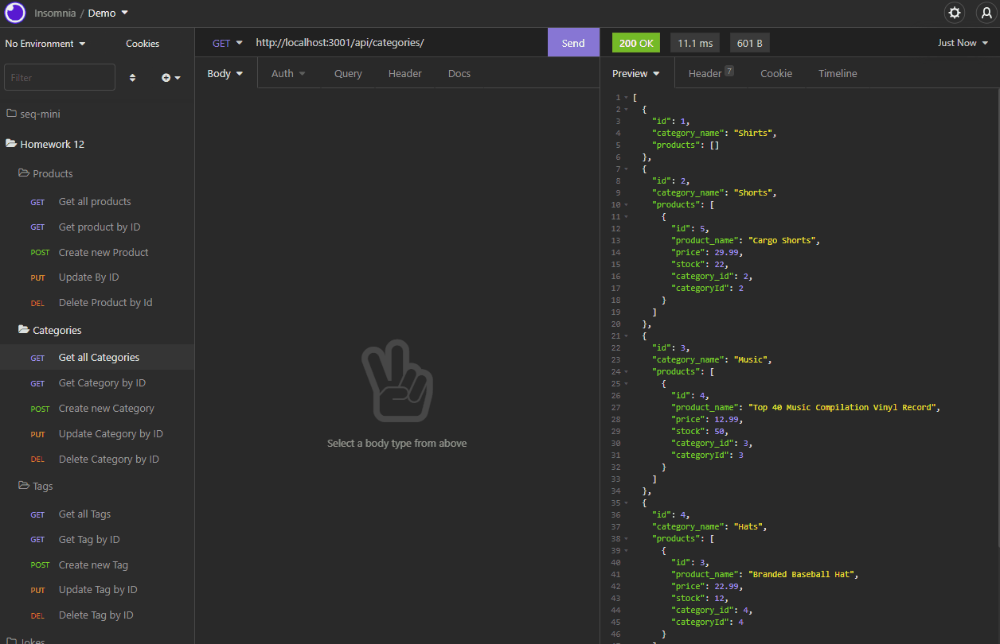
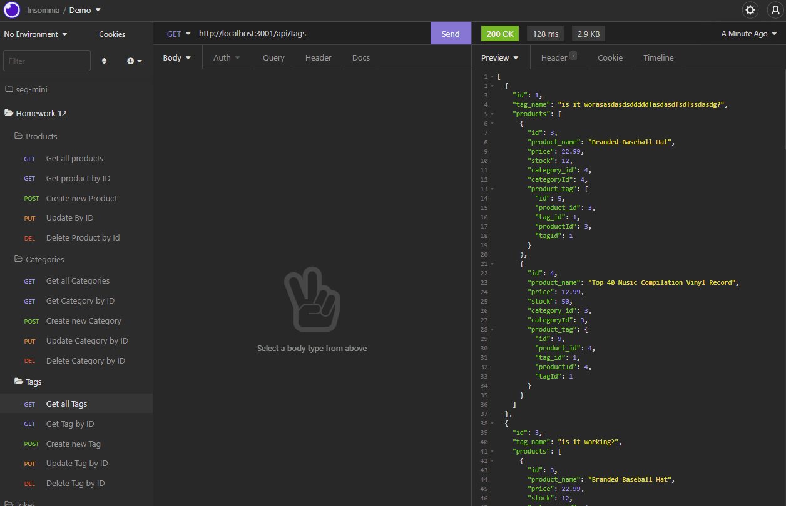

# E-Commerce Back End 

## Description

I built this E-Commerce back-end server application by utilizing the MySQL2 npm package, Sequelize Package, dotenv package and Express package. This program has full CRUD (create, read, update, and delete) functionality through API routes.

## Table of Contents

- [Installation](#installation)
- [Usage](#usage)
- [License](#license)
- [Contributing](#contributing)
- [Tests](#tests)
- [Questions](#questions)
- [Credits](#credits)

## Installation

- Clone [this repo](https://github.com/idpetersen/e-commerce) from my Github to the users computer by running the command in the terminal.

`git clone <ssh key>`

- Open VScode with this repository and run the following command with the integrated terminal.

`npm i`

- Once installation is complete, the user will need to access the mysql shell by running the following command.

`mysql -u root -p<user-password>`

- Run the following command in the sql shell to create the neccessary database to run the application.

`SOURCE db/schema.sql`

- Then exit the sql shell by running the following command.

`exit`

- If the user would like to use pre-seeded data for the database, use the following command in the integrated terminal.

`node seeds/index.js`

- If the user would like to start from an empty database, disregard the above command.

- To launch the application on the user's local computer, the following command will need to be ran

`node server.js`

## Usage

The user has the option to use this application from the deployed site by using the following url endpoints:

- [/api/products](https://young-citadel-78592.herokuapp.com/api/products) to view all products. Or the user has the option to look up a product by id by adding an `id#` to the end of the url. For example https://young-citadel-78592.herokuapp.com/api/products/2

- [/api/categories](https://young-citadel-78592.herokuapp.com/api/categories) to view all categories. Or the user has the option to look up a category by id by adding an `id#` to the end of the url. For example https://young-citadel-78592.herokuapp.com/api/categories/3

- [/api/tags](https://young-citadel-78592.herokuapp.com/api/tags) to view all tags. Or the user has the option to look up a tag by id by adding an `id#` to the end of the url. For example https://young-citadel-78592.herokuapp.com/api/tags/1

OR

The user can install this application on their local maching by following the instructions above. The demo for this program uses Insomnia to execute CRUD requests. To learn how to use and install insomnia click [here](https://insomnia.rest/)

### Product Routes

  
The five routes availible to handle requests for products:

- Get all product route returns a JSON containing all products in the database.

- Get product by ID returns a JSON containing a specific product as requested by the client.

- Put updates an existing product by ID (takes a certain format, comment on that format is located in product-routes.js).

- Post product creates a new product (takes a certain format, comment on that format is located in product-routes.js).

- Delete product takes an ID of a product that exists and deletes it.

### Category Routes

  
The five routes availible to handle requests for categories:

- Get all categories route returns a JSON containing all categories in the database.

- Get category by ID returns a JSON containing a specific category as requested by the client.

- Put updates an existing category by ID (takes a category name in JSON format with the new name).

- Post product creates a new category (takes a category name in JSON format with a new name).

- Delete category takes an ID of a category that exists and deletes it.

### Tag Routes

  
The five routes availible to handle requests for tags:

- Get all tags route returns a JSON containing all tags in the database.

- Get tag by ID returns a JSON containing a specific tag as requested by the client.

- Put updates an existing tag by ID (takes a tag name in JSON format with the new name).

- Post tag creates a new tag (takes a tag name in JSON format with a new name).

- Delete tag takes an ID of a tag that exists and deletes it.

## License

MIT License

Copyright &copy; Isaac Petersen 2022

Permission is hereby granted, free of charge, to any person obtaining a copy
of this software and associated documentation files (the "Software"), to deal
in the Software without restriction, including without limitation the rights
to use, copy, modify, merge, publish, distribute, sublicense, and/or sell
copies of the Software, and to permit persons to whom the Software is
furnished to do so, subject to the following conditions:

The above copyright notice and this permission notice shall be included in all
copies or substantial portions of the Software.

THE SOFTWARE IS PROVIDED "AS IS", WITHOUT WARRANTY OF ANY KIND, EXPRESS OR
IMPLIED, INCLUDING BUT NOT LIMITED TO THE WARRANTIES OF MERCHANTABILITY,
FITNESS FOR A PARTICULAR PURPOSE AND NONINFRINGEMENT. IN NO EVENT SHALL THE
AUTHORS OR COPYRIGHT HOLDERS BE LIABLE FOR ANY CLAIM, DAMAGES OR OTHER
LIABILITY, WHETHER IN AN ACTION OF CONTRACT, TORT OR OTHERWISE, ARISING FROM,
OUT OF OR IN CONNECTION WITH THE SOFTWARE OR THE USE OR OTHER DEALINGS IN THE
SOFTWARE.

  

## Contributing

To contribute, please contact me via [Github](https://www.github.com/idpetersen) or [email](mailto:isaac.petersen5@gmail.com)

## Tests

Testing was completed and done by me through the integrated terminal of VScode.

## Questions

Contact me via [Github](https://www.github.com/idpetersen) or [email](mailto:isaac.petersen5@gmail.com)

## Credits

Thanks to [Sabrina Hanson](https://www.github.com/sabhanson) for the collaboration!
